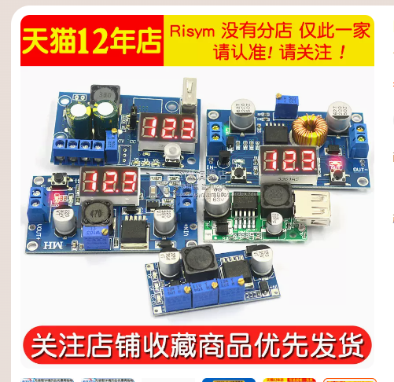
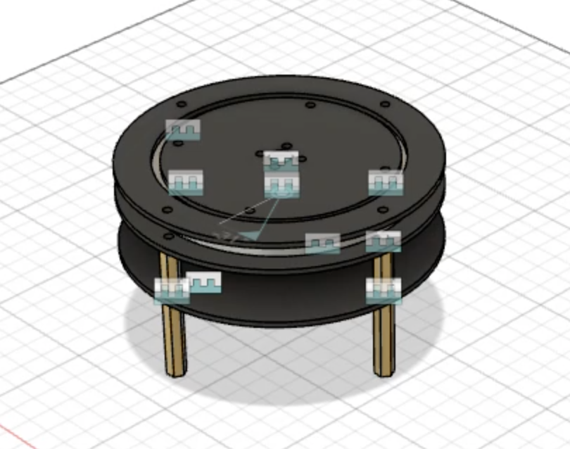
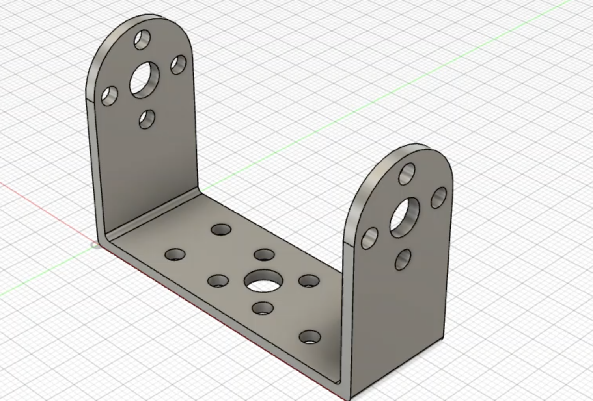
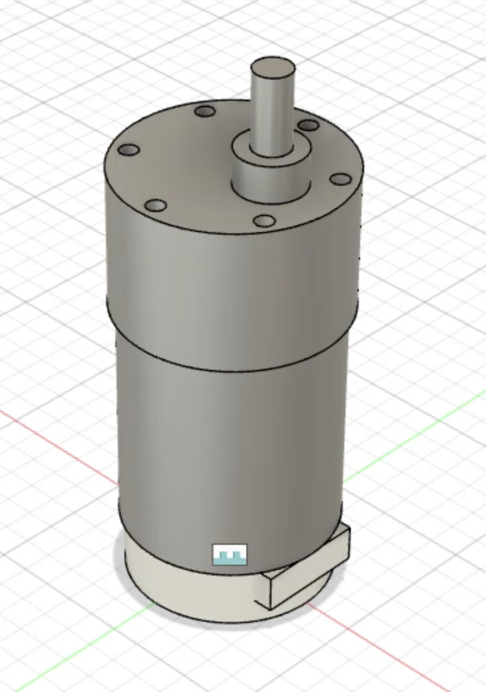
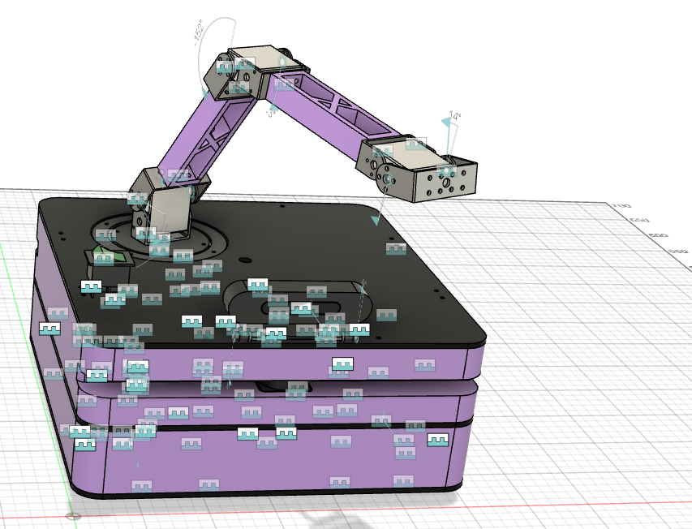

# **基于树莓派的智能物料搬运小车的系统设计**

## ***一，研究背景***
>
>        在现代物流和制造业中，物料搬运是一个不可或缺的环节。传统的物料搬运通常依赖于人工操作或传统的机械设备，但这些方法存在着一些限制和挑战。人工操作可能受到工人疲劳、人力资源限制和效率低下的问题影响。传统机械设备则可能受到固定路线和复杂环境下的机动性限制。
>        然而，随着人工智能和自动化技术的快速发展，智能物料搬运小车作为一种新型的物流解决方案已经开始崭露头角。这些小车集成了先进的感知、规划和控制系统，能够自主地感知环境、规划最优路径并执行搬运任务。智能物料搬运小车的出现为物流和制造业带来了许多机遇和改进空间。

---

## ***二，设计目的***
>        物流和制造业是现代经济中至关重要的组成部分，而物料搬运作为物流过程中不可或缺的环节，对于企业的运营效率和竞争力起着至关重要的作用。传统的物料搬运方法往往面临着一系列的挑战，为了应对这些挑战，人工智能和自动化技术成为了物流行业关注的焦点。智能物料搬运小车作为一种新兴的物流解决方案，具备了自主感知、智能规划和高效执行的能力。通过利用先进的传感器技术、路径规划算法和控制系统，智能物料搬运小车能够准确感知环境、自主规划最优路径，并在复杂的物流环境中高效地执行搬运任务。  
>        此次个性化实践，我将重点研究智能物料搬运小车的零部件的选型、建模、设计以及制作过程。

---

## ***三，零件选型***

> 1. 麦克纳姆轮  
>   
>    > 使用麦克纳姆轮作为智能物料搬运小车的轮胎具有以下优点：  
>    >    > 多向移动能力：麦克纳姆轮是一种特殊的全向轮，具有独特的轮胎结构和布局。它由多个斜向排列的轮辋组成，使得小车能够在不转向的情况下实现平稳的多向移动。这种设计使得小车可以自由地在水平和垂直方向上移动、旋转和平移，从而在狭小的空间中灵活操作和搬运物料。  
>    > 
>    >    > 卓越的机动性：麦克纳姆轮的布局和运动原理使得小车具有卓越的机动性。每个轮子都可以独立运动，无论是向前、向后、向左还是向右，都可以实现精确的控制。这种机动性使得小车能够轻松地避开障碍物、穿过狭窄的通道和转弯，提高了操作的灵活性和效率。  
>    > 
>    >    > 高精度定位：麦克纳姆轮的运动特性使得小车能够实现高精度的定位和操控。通过对每个轮子的独立控制，可以精确地调整和控制小车的位置和姿态。这种精度定位的能力对于准确搬运和定位物料非常重要，特别是在需要精细操作的环境中。
>
> 2. 电机驱动  
> 
> 
>    > 这是一款可驱动大功率电机的电机驱动模块，具有大电流，高驱动的特点。
>
> 3. 调试下载器  
> 
>    > 这款高速无线调试下载器支持仿真调试、程序下载、无线串口功能，提供20P标准JTAG借口和4P简化SWD接口，能够很大程度上帮助我调试小车。
>
> 4. 舵机  
> 
>    > 舵机采用飞特金属磁编码总线舵机，该产品具有以下特点，能够方便我们后期调试云台、机械臂、机械爪。  
>    >    > * 外壳采用CNC全铝合金，具有良好的导热性能。  
>    >    > * 全钢齿轮和轴承设计，强度更高，寿命更长。  
>    >    > * 采用空心杯电机作为动力源，具备无铁芯、转子、电感小、响应性好、效率高、体积小易取得大扭矩。  
>    >    > * 多圈大角度精准控制，最高精度下可以正负7圈绝对位置控制与反馈。  
>    >    > * 12位高精度无接触式磁编码传感器。  
>    >    > * 加速度启动与停止功能，可实现在行程过程中柔和运动，对齿轮有更好的保护作用。  
>    >    > * 支持4种工作模式，分别是位置模式、速度闭环电机模式、速度开环电机模式、步进模式。  
>    >    > * 一键校准中位，360度角度任意安装，非常方便安装，可提升生产效率和降低维护成本。  
>    >    > * 过载保护。  
>    >    > * 过热保护。  
>    >    > * 实时反馈。  
>    >    > * 角度限位。  
>    >    > * 最大扭矩限制。  
>    >    > * PID比例系统调节。  
>    >    > * 多个舵机串联控制。  
> 5. 打印耗材  
> 
>    > 机械臂机械爪和外壳部分，我计划采用3D打印，我使用的必应PLA-FC材料，与传统PLA材料相比，PLA-FC的韧性与抗冲击强度更优异，使其打印成品具备的物理性能广泛应用于小批量打印工业件，并且它价格便宜，Raise3D官方1kg耗材需要199元，而必应只需要39元。
> 6. 碳纤维板  
> 
>    > 使用碳纤维版作为智能物料搬运小车的底盘具有轻量化、高强度和刚度、抗腐蚀性和耐久性、良好的振动和噪音阻尼、美观性和设计自由度等优点。这些优势使得碳纤维底盘成为一种理想的选择，能够提升小车的性能、稳定性和寿命，为智能物料搬运小车的应用带来更好的效果和体验。
> 7. 电源模块  
> 
>    > 我计划采用3个5A大功率75W稳压电源模块，支持4～38V的宽电压输入范围，一块负责提供5V电压，给树莓派、单片机、模块供电，一块负责提供7.4V电压，给舵机供电，最后一块负责提供12V电压，给电机驱动供电。
> 8. 电池  
> 
>    > 格氏5300mah 4s 14.8V 30C电池，持续放电159A（瞬间318A），动力强劲。
> 9. 电机  
> 
>    > WHEEL TEC的MG540大功率直流减速电机（高精度GMR编码器款），GMR编码器是霍尔编码器精度的38倍，在低速情况下表现优异。
> 10. 激光雷达  
> 
>     > 基于TOF原理的LD19激光雷达可抗强光，可有效避免强光照干扰，可抵抗30000Lux的强光环境，可实现室内外高频高精度的距离测量及精准建图。LD19测量半径可以达到13.4m，扫描频率10HZ，采样频率4500次/s。内置无刷电机相比传统的有刷电机具有更高的效能，寿命更长。
> 11. 深度相机  
> 
>     > Gemini Pro相机基于双目结构光（红外投影）测距原理，高达8米深度测距，特别适合机器人三维环境重建，提高环境建模效率，测量盲区低至0.25米，特别适用于近距离测量，广泛应用于机器人末端执行器定位等应用场景。Gemini Pro使用了D435i等国际知名相机惯用的成熟双目架构，支持在室外场景使用。它带有可以自由旋转的铰链支座，安装简单，方便调整相机视角，金属加工，更加稳固耐用。
> 12. 树莓派  
> 
>     > 树莓派是一款基于ARM架构的单板计算机，具有较强的计算和处理能力。它采用高性能的处理器和足够的内存，能够处理复杂的算法和任务，支持实时控制和决策。这使得树莓派能够实现复杂的路径规划、感知处理和决策算法，提高智能物料搬运小车的智能化水平。树莓派提供了丰富的接口和扩展插槽，包括GPIO、USB、HDMI等接口，可以连接各种传感器、执行器和外部设备。这使得树莓派可以方便地与硬件组件进行通信和控制，实现与激光雷达、下位机、摄像头等设备的无缝集成。树莓派具有广泛的开发者社区和大量的开源软件资源，提供了丰富的开发环境和工具支持。开发者可以利用Python、C++等编程语言进行开发，并借助各种开源库和工具快速实现功能。这降低了开发门槛，加快了系统开发和调试的速度。
> 13. 无线网卡  
> 
>     > 鉴于树莓派自带的无线能力弱，我外置了一款USB3.0的无线网卡。
> 14. USB摄像头  
> 
>     > 末端执行器采用便宜的USB摄像头，可以实现物料识别与定位。
> 15. STM32  
> 
>     > 采用高性能的STM32F407最小系统板作为下位机，实现运动控制算法。
> 16. 惯性导航模块  
> 
>     > N100惯导模块具备丰富的数据输出，支持三轴加速度、三轴陀螺仪、三轴磁力计、三轴欧拉角、四元数、方向余弦矩阵、速度、位置输出，自带卡尔曼融合算法。

---

## ***四，PCB板设计***

> 1. 绘制原理图
>    > * STM32F407  
>    >    >  
>    > * 电机接口  
>    >    >   
>    > * 电机驱动接口  
>    >    >   
>    > * 外部传感器接口  
>    >    >   
> 2. 绘制PCB
>    >  

---

## ***四，零件建模***
> 1. 惯性导航模块  
>    > 
> 2. 37电机支架  
>    > 
> 3. DC电源模块 
>    > 
> 4. SCS125舵机  
>    > 
> 5. SCS2332舵机  
>    > 
> 6. STS3020舵机  
>    > 
> 7. USB摄像头  
>    > 
> 8. 云台  
>    > 
> 9. 舵机支架  
>    >  
> 10. BTN7971四路驱动  
>     > 
> 11. 舵盘  
>     >  
> 12. TTL信号转换板  
>     > 
> 13. 机械臂  
>     > 
> 14. 树莓派  
>     > 
> 15. 联轴器  
>     > 
> 16. 深度相机  
>     > 
> 17. 激光雷达  
>     > 
> 18. 机械爪  
>     > 
> 19. 电机  
>     > 
> 20. 船型开关  
>     > 
> 21. 散热风扇  
>     > 
> 22. 麦克纳姆轮  
>     > 

----

## ***五，小车结构设计***

> * 设计底盘2  
>     > 
> * 安装4个直流减速电机  
>     > 
> * 安装4个麦克纳姆轮  
>     > 
> * 设计底盘1  
>     > 
> * 装配底盘1  
>     > 
> * 给底盘1开4个矩形孔  
>     > 
> * 设计底盘3  
>     > 
> * 装配底盘3  
>     > 
> * 开一个放置云台的孔  
>     > 
> * 放置云台  
>     > 
> * 设计放置电池的位置  
>     > 
> * 放置电池  
>     > 
> * 设计放置电机驱动板的位置  
>     > 
> * 放置电机驱动板  
>     > 
> * 设计放置电源模块的位置  
>     > 
> * 放置电源模块  
>     >   
> * 放置2个激光雷达  
>     >   
> * 放置TTL信号转换板  
>     >   
> * 放置惯性导航模块  
>     >   
> * 放置树莓派  
>     >   
> * 放置深度相机  
>     >   
> * 放置下位机控制板  
>     >   
> * 完成外壳1设计  
>     >   
> * 完成外壳2设计  
>     > 
>     > 
>     >   
> * 设计机械臂  
>     > 
>     > 
>     > 
>     >   
> * 放置机械爪  
>     >   
> * 完成运动分析  
>     >   

## ***六，物流小车组装***
  